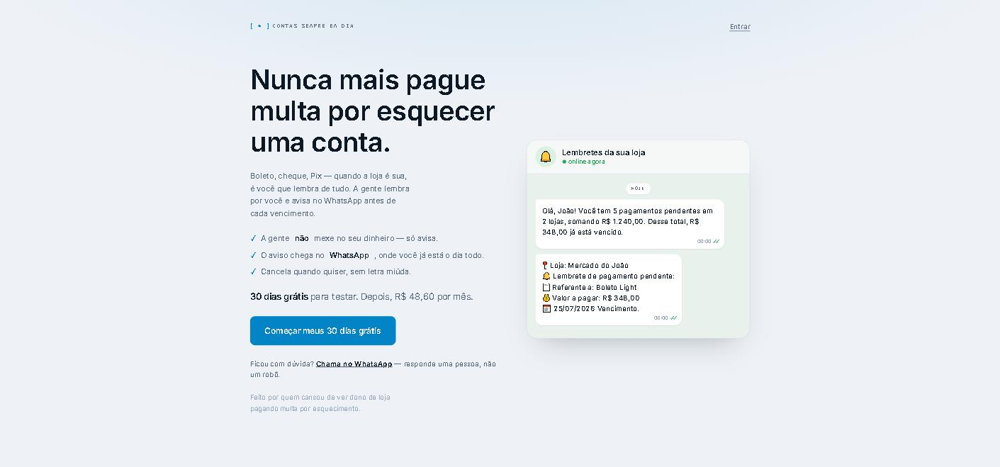
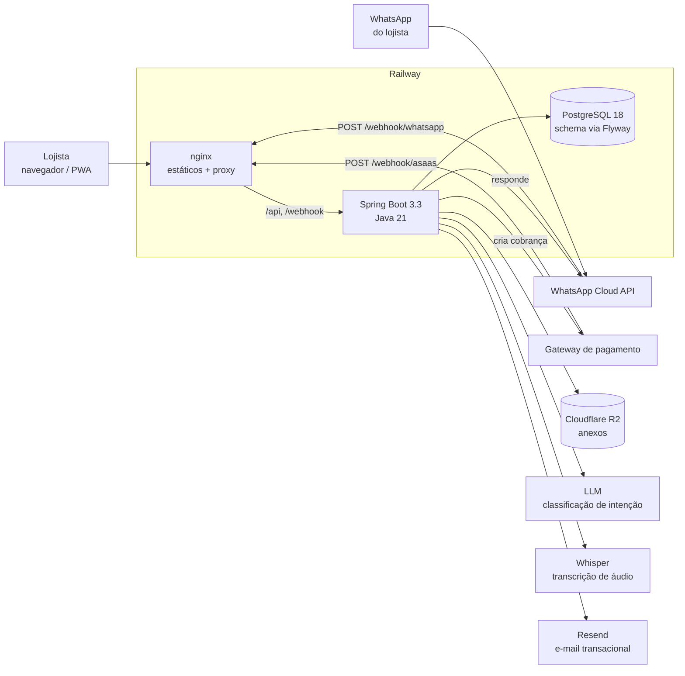

# Agenda de Pagamentos

[](https://github.com/ErickGeovane0706/agenda-pagamentos/actions/workflows/ci.yml)


Sistema de gestão de contas a pagar para redes com múltiplas lojas: boletos, PIX e cheques
num só lugar, com lembretes e consultas por WhatsApp.

O diferencial do projeto é o **agente de WhatsApp**: o usuário pergunta *"quanto tenho pra pagar
essa semana?"* — por texto ou por áudio — e recebe a resposta pronta, sem abrir o app.

> **Em produção, com clientes reais.** O sistema roda em
> [diadepagar.com.br](https://www.diadepagar.com.br) — multi-empresa, multi-loja,
> com assinatura cobrada por loja, webhook de pagamento e agente de WhatsApp atendendo.
> Não é um projeto de demonstração: cada decisão registrada em
> [`docs/adr/`](docs/adr/README.md) foi tomada com alguém dependendo do resultado.

[](https://www.diadepagar.com.br/comecar)

<p align="center"><sub>A landing pública. O balão à direita é o formato em que o lembrete
chega — o público é dono de loja que vive no WhatsApp, e para ele metade da venda é tirar o
medo, não criar desejo.</sub></p>

---

## Arquitetura



O nginx não é só servidor de estáticos: ele **re-resolve o endereço do backend a cada
requisição**, porque o IP muda a cada deploy — ver
[ADR-0010](docs/adr/0010-nginx-re-resolve-o-backend.md).

### O caminho de uma pergunta no WhatsApp

```mermaid
sequenceDiagram
    participant L as Lojista
    participant M as WhatsApp Cloud API
    participant C as WhatsAppWebhookController
    participant S as Agente (@Async)
    participant D as PostgreSQL

    L->>M: "quanto tenho pra pagar essa semana?"
    M->>C: POST /webhook/whatsapp
    C-->>M: 200 OK (imediato)
    Note over C,S: a Meta exige resposta em poucos<br/>segundos; o processamento é assíncrono
    S->>S: áudio? baixa a mídia e transcreve
    S->>S: classifica a intenção e extrai filtros
    S->>D: consulta pendências da empresa
    D-->>S: resultado
    S->>M: envia a resposta
    M->>L: mensagem pronta
```

---

## Stack

**Backend** — Java 21, Spring Boot 3.3.5, PostgreSQL, Flyway, Spring Security (JWT),
Bucket4j (rate limiting), AWS SDK S3 (Cloudflare R2), Apache POI (exportação `.xlsx`).

**Frontend** — React 18, TypeScript, Vite 5, Tailwind, TanStack Query, Zustand,
React Hook Form, React Router.

**Integrações** — WhatsApp Cloud API (Meta), Anthropic Claude (classificação de intenção),
OpenAI Whisper (transcrição de áudio), Cloudflare R2 (arquivos).

**Deploy** — Railway (Dockerfile), webhook exposto via nginx.

---

## Funcionalidades

### Agenda de pagamentos
Boletos, pagamentos PIX e cheques, cada um com loja, fornecedor, valor, vencimento, status
(pendente / pago / vencido) e anexo opcional (imagem ou PDF do documento). Colunas extras
configuráveis por empresa. Filtros por loja, status, período e fornecedor.

### Leitor de código de barras
Três formas de capturar o código de um boleto, no `ModalLeitorCodigo`:

- **Câmera** (celular) — leitura ao vivo com ZXing. A tela gira para paisagem antes de a câmera
  abrir, o que permite aproximar o aparelho do papel e ler em poucos segundos.
- **Imagem** — OCR com Tesseract.js.
- **PDF** — extrai o texto embutido e, se não houver, cai em OCR da página escolhida.

Reconhece boleto bancário (47 dígitos), convênio/concessionária, DARF, GPS/INSS, DAS/MEI,
GNRE, GRU, multas e código de barras puro (44 dígitos).

### Agente de WhatsApp
Webhook recebe a mensagem, valida a assinatura HMAC da Meta, descarta duplicatas
(idempotência) e classifica a intenção com Claude Haiku. Mensagens de **voz** são baixadas da
Graph API e transcritas com Whisper antes de seguir pelo mesmo caminho de uma mensagem
digitada — os modelos Claude não aceitam áudio como entrada, daí o segundo fornecedor.

Entende jargão de período ("essa semana", "quinzena", "mês que vem"), tipo de pagamento e
status. Teto de 15 mensagens por remetente a cada 5 minutos — cada mensagem, de texto **ou**
áudio, custa exatamente 1 token do mesmo bucket, porque ambas disparam chamadas pagas de IA.

### Lembretes automáticos
`NotificacaoWhatsAppScheduler` roda a cada minuto e dispara os lembretes de vencimento no
horário que cada usuário configurou.

### Relatórios
Consulta consolidada e exportação em `.xlsx` (Apache POI) e PDF.

### LGPD
Endpoints de acesso, correção e exclusão de dados pessoais. A exclusão é processada por um job
diário (`SchedulerService`, 03:00).

### Multi-tenant
Toda operação é isolada por empresa. O `empresaId` vem do JWT, é colocado no `TenantContext`
pelo `JwtAuthFilter` e conferido em cada serviço — nenhuma query confia em ID vindo do cliente.
Perfis: `MASTER` (gestão de empresas), `ADMIN` e `OPERADOR`.

---

## Decisões de arquitetura

As decisões que não são óbvias no código — e que alguém tentaria "melhorar" sem saber o que
estão segurando — estão registradas em [`docs/adr/`](docs/adr/README.md): por que o item de
venda copia o preço em vez de lê-lo do cadastro, por que a baixa de estoque é um `UPDATE`
condicional, por que módulo não contratado responde `403` e não `402`, por que o hash da senha
é calculado antes da consulta ao banco.

## Estrutura

```
backend/src/main/java/com/agenda/
├── domain/           # um pacote por domínio (controller + service + entidade + DTOs)
│   ├── auth/         # login, refresh token, logout
│   ├── boleto/  pix/  cheque/     # os três tipos de pagamento
│   ├── arquivo/      # upload/download no R2
│   ├── notificacao/  # preferências + scheduler dos lembretes
│   ├── whatsappagent/# webhook, classificador de intenção, transcrição de áudio
│   ├── relatorio/  lgpd/  empresa/  loja/  usuario/  banco/  coluna/  webhook/
├── security/         # JWT, filtros, rate limiter, blacklist de token
├── whatsapp/         # cliente da Cloud API + download de mídia
├── r2/               # configuração do client S3 apontando pro Cloudflare R2
├── job/              # jobs agendados
├── auditoria/        # trilha de auditoria das escritas
└── shared/           # TenantContext, UserContext, exceções

frontend/src/
├── pages/            # Login, SelecionarLoja, Agenda, Relatórios, Configurações, Empresas
├── components/agenda/# tabelas, cards, modais, leitor de código de barras
├── api/  hooks/  store/  types/  utils/
```

---

## Rodando local

**Pré-requisitos:** Java 21, Maven, Node 18+, Docker (para o Postgres).

### 1. Variáveis de ambiente

```bash
cp .env.example .env                    # backend e docker-compose
cp frontend/.env.example frontend/.env  # frontend
```

Os dois `.env.example` são a lista completa e comentada; os `.env` estão no `.gitignore` e
nunca são commitados.

Para rodar o básico (login, agenda, paginação), só o banco e o `JWT_SECRET` precisam ser reais
— as chaves de integração podem ficar vazias. Sem Asaas não há cobrança, sem R2 não há anexo,
sem Resend não há e-mail, sem chave de IA o agente não classifica intenção. O resto funciona.

### 2. Banco

```bash
docker compose up db
```

O Flyway aplica as migrations (`V1` a `V25`) sozinho na subida do backend.
`ddl-auto` é `validate`: o schema **nunca** é alterado pelo Hibernate, só por migration.

### 3. Backend

```bash
cd backend
mvn spring-boot:run     # sobe em http://localhost:8080, profile "local"
```

### 4. Frontend

```bash
cd frontend
npm install
npm run dev             # http://localhost:5173
```

---

## Variáveis de ambiente

A lista completa, comentada e agrupada por função está nos dois arquivos de exemplo —
[`.env.example`](.env.example) (backend) e [`frontend/.env.example`](frontend/.env.example).
Eles são a fonte: uma tabela aqui envelheceria em silêncio.

Três que não se explicam sozinhas:

| Variável | Por que merece atenção |
|---|---|
| `ASAAS_WEBHOOK_TOKEN` | sem ela o webhook **falha fechada** e recusa tudo — é proposital, e não um bug de configuração |
| `APP_FRONTEND_URL` | tem que ser o mesmo domínio cadastrado no gateway; ele recusa uma `successUrl` de outro domínio com `400` |
| toda `VITE_*` | é lida na **compilação**, não em runtime: precisa chegar ao `npm run build`, e por isso o `Dockerfile` do frontend declara um `ARG`/`ENV` para cada uma. Definir só no painel da hospedagem não basta, e a falha é silenciosa |

---

## Testes

```bash
cd backend && mvn test          # 397 testes
cd frontend && npm run build    # typecheck (tsc -b) + build
```

O backend tem cobertura de serviço e controller nos caminhos que importam: isolamento
multi-tenant, agente de WhatsApp, validação de upload, JWT, scheduler, estoque e relatório.
O frontend **não tem suíte de testes** — a verificação é o typecheck e o build.

⚠️ **`mvn test` exige o Docker ligado.** Os testes de schema e de relatório sobem um Postgres
real via Testcontainers, porque são a única forma honesta de provar que as migrations aplicam
e de qual tabela a agregação lê preço. Com o Docker desligado eles falham com `ContainerFetch`
— problema de ambiente, não de código.

---

## Segurança

**Isolamento multi-tenant.** Toda operação compara a empresa do recurso com a do
`TenantContext` e lança 403 se divergir. A chave de arquivo no R2 nunca vem do cliente — sempre
sai do banco, o que fecha o buraco clássico de assinar URL para objeto alheio.

**Upload.** O tipo do arquivo é decidido pelos **bytes** (assinatura do formato), nunca pelo
`Content-Type` que o cliente declara — senão um SVG com script passaria como imagem e o R2 o
devolveria executável. Só JPEG, PNG, WEBP e PDF, até 10 MB. A extensão da key é derivada do
tipo detectado, não do nome do arquivo. URLs de download são assinadas e valem 15 minutos.

**Rate limiting.** Login (por e-mail), webhook do WhatsApp (por telefone) e upload
(60 por empresa a cada 10 min). Sempre por **identidade**, nunca por IP: identidade não é
falsificável como um `X-Forwarded-For`, e um IP mal extraído atrás de proxy colapsaria todos os
usuários num bucket só.

**Auth.** JWT com refresh token e blacklist de logout.

---

## Deploy

Railway, via `Dockerfile` (`backend/railway.json`). O webhook do WhatsApp é exposto por nginx.
Push na `master` dispara o deploy.

As variáveis de ambiente são cadastradas no painel do Railway — o `.env` é só local e não sobe.

---

## Limitações conhecidas

**Rate limiter em memória.** Os buckets vivem na memória da instância: com mais de uma
instância, o teto real é multiplicado, e um restart zera as contagens. Serve para cortar abuso,
mas não é uma quota contábil.

**Câmera exige HTTPS.** O leitor de código de barras não funciona apontando o celular para o
servidor local (HTTP) — `getUserMedia` só roda em contexto seguro. Testes de câmera precisam do
ambiente publicado.

**Dependência não usada.** `@ericblade/quagga2` está no `package.json` mas nenhum código a
importa — o leitor usa ZXing. Provável resíduo de uma implementação anterior.
